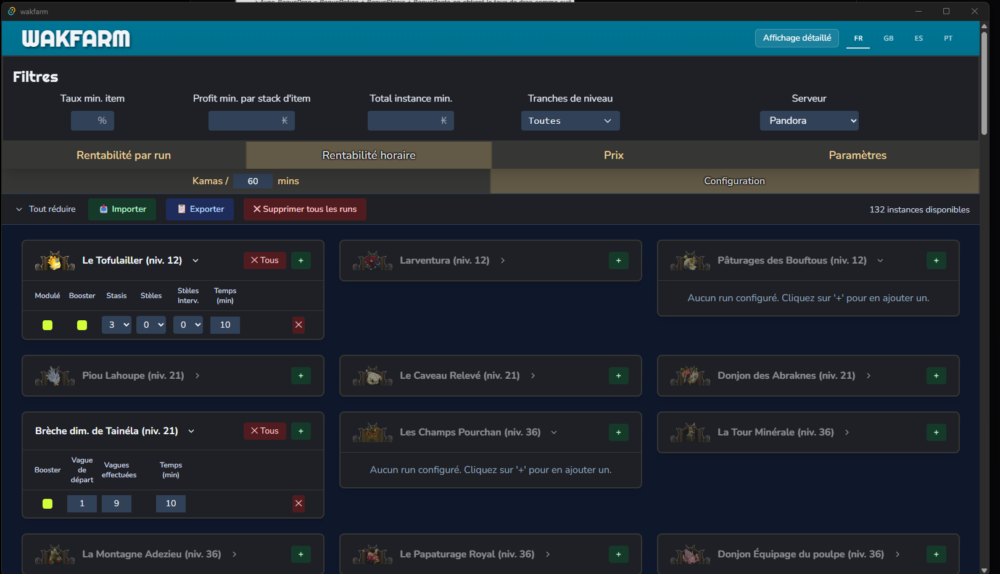
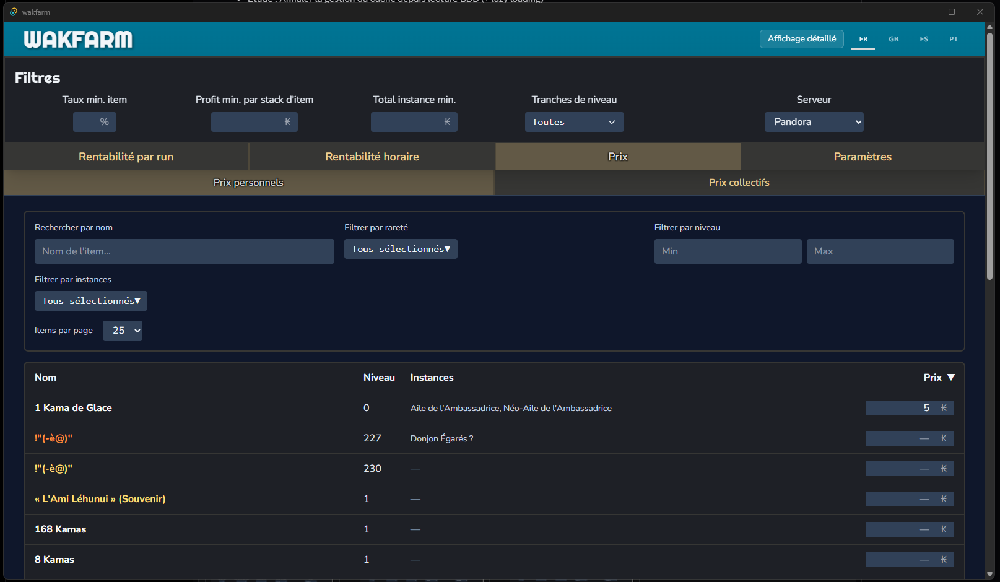
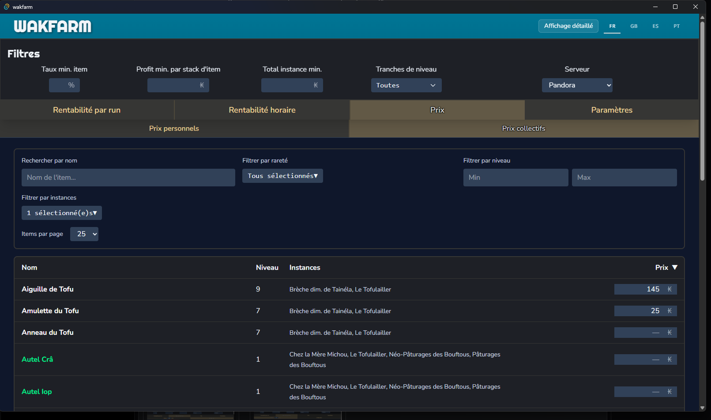

# WakFarm - Calculateur de Rentabilité Wakfu

Application desktop multi-plateforme pour calculer la rentabilité des donjons Wakfu avec partage des prix en temps réel.

## 🎯 Fonctionnalités

- **Calcul de rentabilité** par donjon/instance
- **Deux types de prix**:
  - 💾 Prix personnels (localStorage, local uniquement)
  - ☁️ Prix collectifs (Firestore, temps réel, communauté)
- **3 serveurs Wakfu** (Pandora, Rubilax, Ogrest)

## Captures d'écran

### Calcul de rentabilité par run

### Rentabilité horaire

### Récapitulatif rentabilité horaire

### Prix personnels

### Prix collectifs

## Stack Technique

- **Frontend**: Vue 3 + Vite
- **Desktop**: Tauri
- **Données locales**: localStorage (config, prix perso)
- **Données cloud**: Firebase Firestore (prix collectifs)
- L'essentiel du code a été produit à l'aide de Copilot.

## 📄 Licence

Licence MIT. Voir le fichier LICENSE.

## 📞 Support

Contact Discord dans l'application.

## ⚠️ Copyright

Les images et certaines donnees de ce depot proviennent du repository wakassets et sont **copyright © Ankama**.

## 🙏 Remerciement

**MethodWakfu** et **Waklab** pour le mapping des instances.
L'équipe **Wakfu** d'avoir donné les fichiers .json pour certaines données.
Les personnes qui ont pu me donner d'autres .json qui ont été utiles.
La communauté du jeu, tout ceci n'est possible que grâce à un travail collectif.